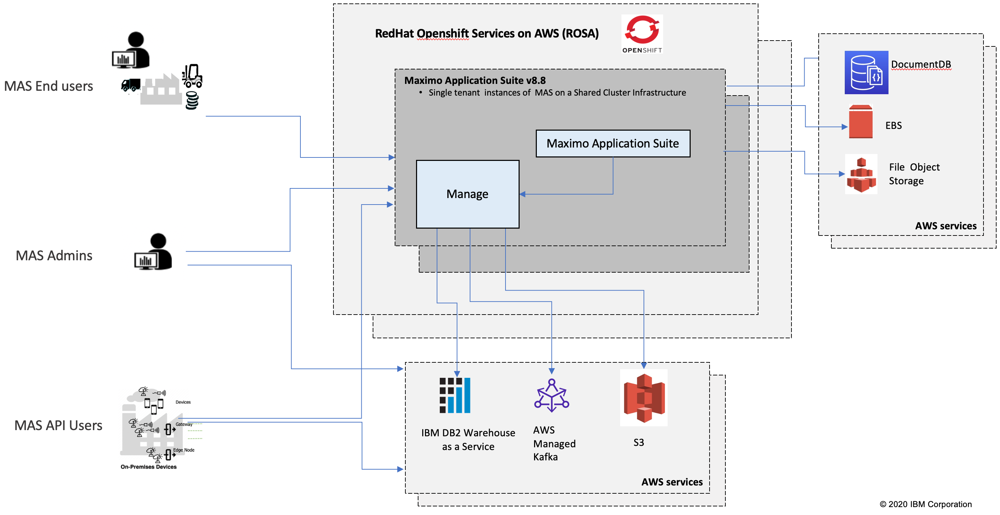

---

copyright:
  years: 2015, 2020
lastupdated: "2020-11-12"

subcollection: mas-saas

---

{:shortdesc: .shortdesc}
{:screen: .screen}  
{:codeblock: .codeblock}  
{:pre: .pre}
{:tip: .tip}
{:note: .note}
{:external: target="_blank" .external}

# Architecture
{: #architecture}

## Cloud Architecture
{: #cloud-architecture}

Maximo Application Suite (MAS) is a feature rich suite of applications delivered using key IBM, Red Hat and AWS technologies. The MAS as a Service (MAS-SaaS) delivers this functionality on the Amazon Web Services (AWS) platform.

The current AWS data centers being leveraged for MAS-SaaS are:

- Northern Virginia, United States
- Frankfurt, Germany
 
On site customer visits to AWS data centers are not allowed for security reasons. Street address locations of data centers are not disclosed. This is in accordance to IBM's NIST guidelines and AICPA Trust Services criteria.

## Instance Architecture
{: #instance-architecture}

The following diagram shows a high level overview of the architecture for each individual client instance.

{: caption="Figure 1. MAS-SaaS Architecture" caption-side="bottom"}

## MAS-SaaS Architecture Highlights
{: #mas-saas-architecture-highlights}

* MAS-SaaS customers are provisioned a single (1) environment by default
* All clients will be provisioned in their own application instance using a dedicated namespace
* IT Administration for the environment is solely managed by IBM's MAS-SaaS SRE operations team
* Clients can access their environment via browser based URL
* MAS-SaaS is an internet based offering that runs over HTTPS. There is no private cloud or direct connect option for MAS-SaaS
* Clients are provided application administrator access
* All servers are Red Hat Linux O/S
* Maximo Manage databases are IBM DB2 Warehouse.  Oracle and MS SQLServer are not supported.

## MAS-SaaS Integrations
{: #mas-saas-integrations}

IBM Maximo Application Suite as a Service supports integration to / from external systems. There are different options available to provide secure integration connections such as SSL, VPN, and Cloud Object Storage integration. HTTPS (SSL) is the standard encryption method and is supported for XML based interfaces using HTTP Post and Web Service endpoints. In addition, the REST API is available over HTTPS. All these integration methods can also be implemented with authentication. Cloud Object Storage is available for integrations that require file based transfers. A Site-to-Site IPsec VPN Tunnel can also be established between the client network and the IBM cloud environment using IBM's firewall in order to support other integration transport methods.

 Integration options include, but are not limited to:

* Support for synchronous and asynchronous exchange of data with applications within the Suite
* Use of common protocols and format such as Web Services, HTTP, JMS, REST, OSLC, XML, JSON, XML and .csv files, DB tables
* Support of Create, Replace, Update, Delete and Query operation
* Support for customizing integration processing using Processing Rules and Scripting
     
For the MS-Manage Application:

* Maximo integration message generation and delivery based on application object events
* Support for implementation (batch) data loading
* Pre-defined (75+) interface components provided along with applications to configure new interfaces
* Support for customizing integration processing using Processing Rules and Scripting

For file based integrations, an AWS S3 Cloud Object Storage location will be allocated for each order.  5 API Keys will be generated for the client to use to move files in and out of the location.  Additional keys can be ordered.  To initiate this process, customers must submit a support case.

One Site-to-Site VPN is included in the order.  To initiate the creation of this VPN, customers must submit a support case.  At this time, the VPN is only available for LDAP integrations.

For clients wanting to use App Connect or File integration for other applications within the suite:

- AppConnect is included as an entitlement with the Maximo Application Suite, but SaaS does not implement or support this within the MAS-SaaS environment.  The client is responsible for implementing AppConnect or beginning with version MAS v8.7, AppConnect SaaS will be supported.

- For clients wanting file integrations with applications other than Manage, this needs to be discussed with the Sales team and an appropriate solution implemented.  COS is only included for the Manage application.
