---

copyright:
  years: 2015, 2020
lastupdated: "2020-11-12"

subcollection: mas-saas

content-type: tutorial
completion-time: 10m

---

{:shortdesc: .shortdesc}
{:screen: .screen}  
{:codeblock: .codeblock}  
{:pre: .pre}
{:tip: .tip}
{:note: .note}
{:external: target="_blank" .external}
{ :toc-completion-time="10m"}

# Getting started with IBM Maximo Application Suite as a Service
{: #getting-started-with-ibm-maximo-application-suite-saas}
{: toc-content-type="tutorial"}
{: toc-completion-time="10m"}

## About
{: #about}

Maximo Application Suite as a Service (MAS-SaaS) provides IBM managed provisioning, installation, configuration, operational support, security, maintenance and administration of Maximo Application Suite for customers on the Amazon Web Services platform (AWS). MAS-SaaS combines key technologies: IBM Maximo, Red Hat Open Shift on AWS (ROSA) and IBM DB2 Warehouse into a focused MAS services solution, allowing customers to make implementation of product functionality & features a priority.

## Before you begin
{: #before-you-begin}

Before you can use Maximo Application Suite as a Service, environments must first be ordered and provisioned by the IBM MAS-SaaS operations team. To obtain more information about the MAS-SaaS offering and available options, please contact your IBM Salesperson or an Authorized IBM Partner. If you do not have an IBM Saleperson or Authorized reseller, please complete and submit the consultation form (link below). An IBM representative will be in contact with you.

https://www.ibm.com/products/maximo?schedulerform=

## Part Numbers and Order Considerations
{: #part-numbers-and-order-considerations}

This section details the part numbers and considerations when placing an order for the Maximo Application Suite as a Service.

There is a single MAS-SaaS PID and part number covering software, infrastructure, operations. MAS-SaaS can be purchased via IBM (SQO) or AWS Marketplace.

* PID 5900-AMG: IBM Maximo Application Suite as a Service
* Part D0A51ZX: IBM Maximo Application Suite as a Service for Other Public Clouds AppPoint

## Welcome Letter
{: #welcome-letter}

When your MAS-SaaS environments have been provisioned, you will receive a Welcome Letter from the IBM MAS-SaaS Operations team. This letter will contain:

* The URLs of each environment that have been provisioned
* The username, corresponding email and password for each environment
* Information on how to activate your environment(s)
* Information on how to access your environment logs

## How to set password and login to MAS
{: #how-to-set-password}

You will need to set a temporary password and then change it when you first login to your MAS-SaaS environment(s).

1. Navigate to your MAS-SaaS login URL and enter your username (sent via Welcome Letter in the username file) and click **Continue**.

    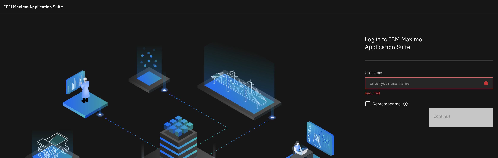{: caption="Figure 1. MAS Login Screen" caption-side="bottom"}

2. Click on **Forgot password?** option in below screen.

    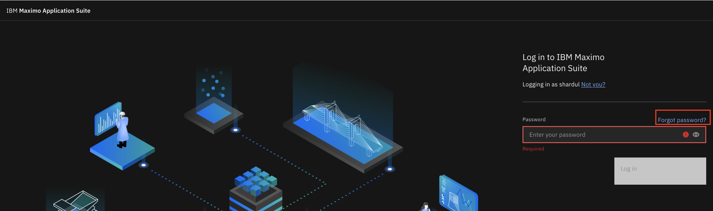{: caption="Figure 2. MAS Login Screen" caption-side="bottom"}

3. A confirmation code will be sent to your e-mail address. Enter the code contained in your email and click **Continue**

    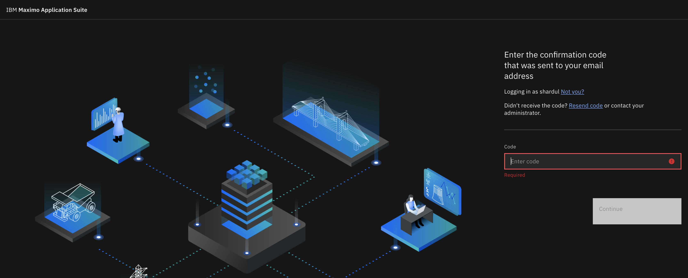{: caption="Figure 3. MAS Login Code Confirmation" caption-side="bottom"}

4. The email with the confirmation code will look similar to below.

    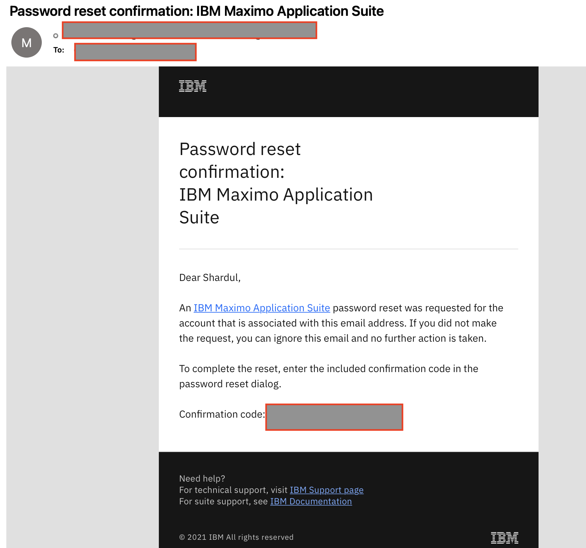{: caption="Figure 4. MAS Login Code Email" caption-side="bottom"}

5. After the code is enter in the above screen with the code you received over an email, you will see below screen asking for the password. You will receive the temporary password (again via email).

    {: caption="Figure 5. MAS Login Temp Password" caption-side="bottom"}

6. Email with the temporary password will look similar to below.

     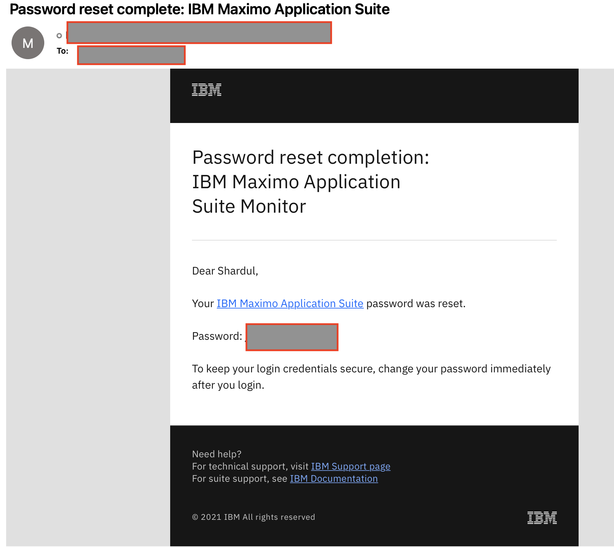{: caption="Figure 6. MAS Login Temp Password email" caption-side="bottom"}

7. Enter the temporary password you received via email in the below screen and you will be able to login to MAS.

    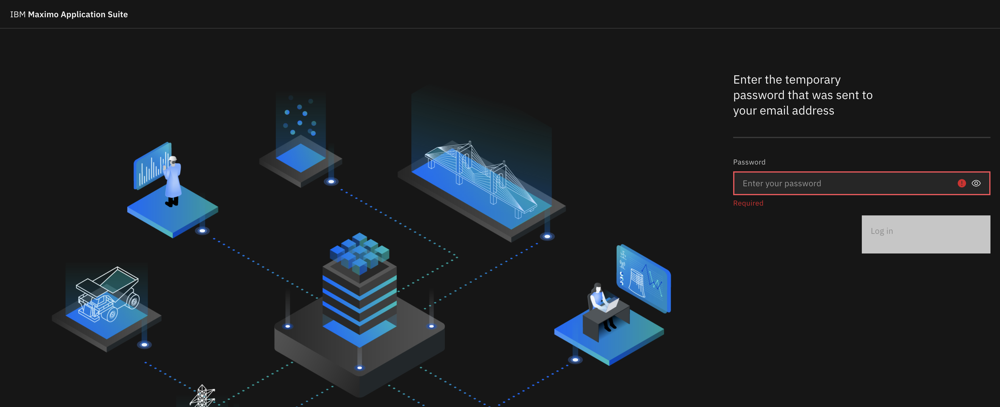{: caption="Figure 7. MAS Login Temp Password" caption-side="bottom"}

8. After you login to MAS, change your password by clicking **Manage profile** under Profile in the right top hand corner.

    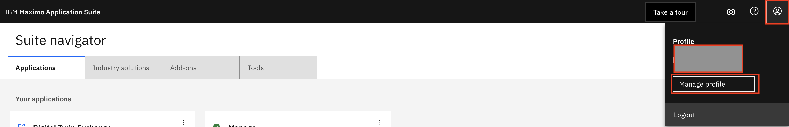{: caption="Figure 8. MAS Login Manage Profile" caption-side="bottom"}

9. Select **Change password** to change your password. Enter the temporary password and then set your new password.

    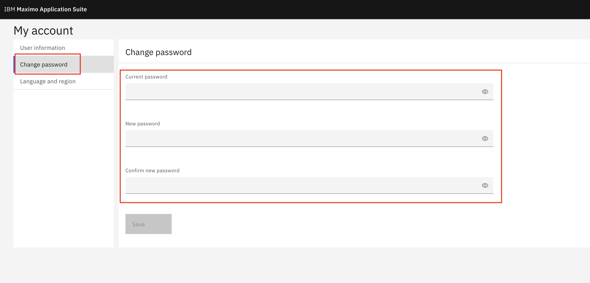{: caption="Figure 9. MAS Login Set Password" caption-side="bottom"}

## How to Create an IBMid
{: #how-to-create-an-ibmid}

In order to register for product support and create cases (tickets) for MAS-SaaS, you will need an IBMid. Note: If you already have an IBMid, please proceed to [How to Register for Maximo Application Suite Support](#how-to-register-for-mas-support)

1. To create an IBMid, click on the following link:
    https://myibm.ibm.com

2. Click **Create an IBMid**

    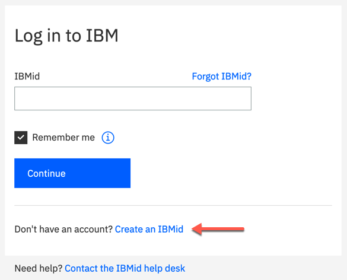{: caption="Figure 1. Create IBMid" caption-side="bottom"}

3. Enter the applicable information (you will need to provide a valid email address) and click **Next**

    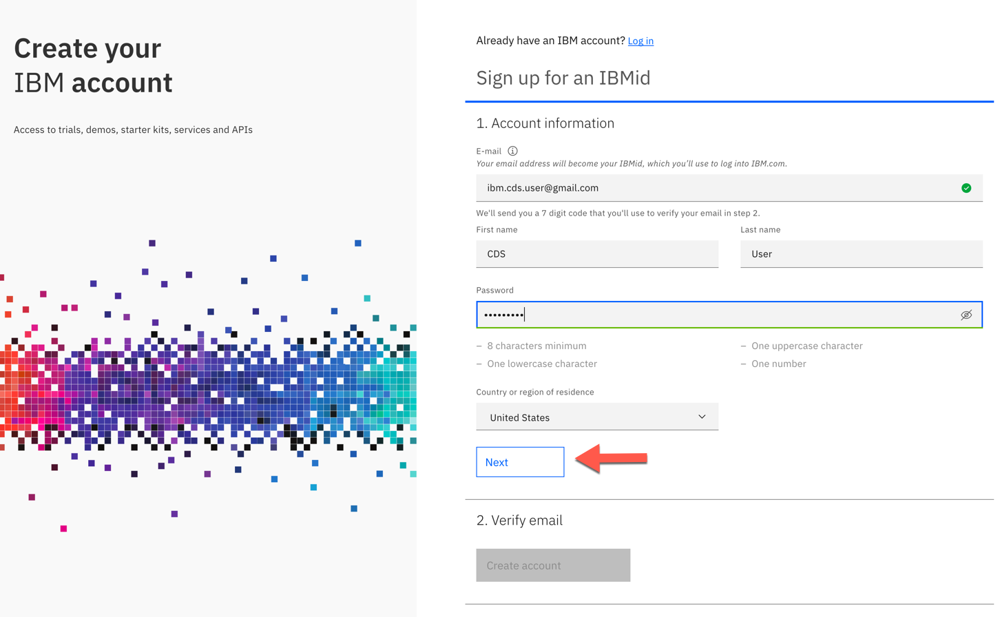{: caption="Figure 2. IBMid - Enter Applicable Information" caption-side="bottom"} 

4. Upon submission, a confirmation code will be sent from `ibmacct@iam.ibm.com` to the email address you provided

    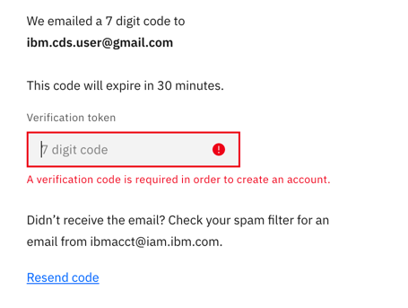{: caption="Figure 3. MAS-MS IBMid Confirmation Code" caption-side="bottom"} 

5. Open your email and copy & paste the 7 digit confirmation code (Verification token).
    Click **Create Account** to activate your IBMid 

    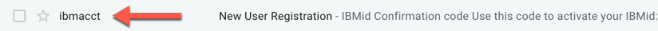{: caption="Figure 4. MAS-MS IBMid Confirmation Code Email" caption-side="bottom"} 

    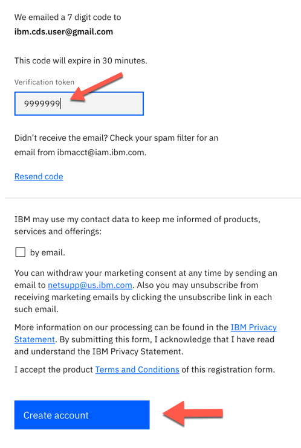{: caption="Figure 5. MAS-MS IBMid Create Account" caption-side="bottom"} 

     
6. Accept IBM Account Privacy notification by clicking **Proceed**

    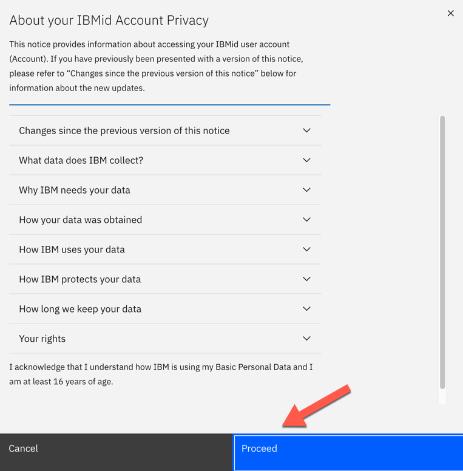{: caption="Figure 6. MAS-MS IBMid Privacy Notification" caption-side="bottom"} 

7. Your new IBMid will be created and registration completed:

    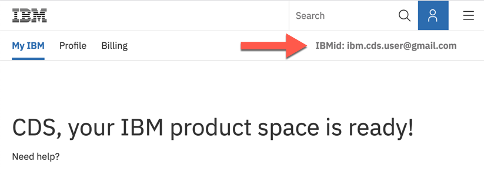{: caption="Figure 7. MAS-MS IBMid Ready" caption-side="bottom"}

    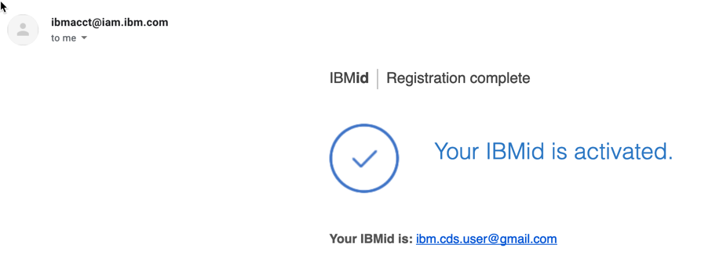{: caption="Figure 8. MAS-MS IBMid Activated" caption-side="bottom"}

After verification/creation of your IBMid has been completed, proceed to the next section [How to Register for MAS-MS Support Services](#how-to-register-for-mas-support)

## How to Register for Maximo Application Suite Support
{: #how-to-register-for-mas-support}

Maximo Application Suite Support covers support for both the Application and your MAS-SaaS environments.

1. Visit the following link:

    https://www.ibm.com/mysupport/s/supportaccess

2. Log in using your IBMid:

    Note: if you don't have an IBMid, please reference the following link: [How to Create an IBMid](#how-to-create-an-ibmid)

    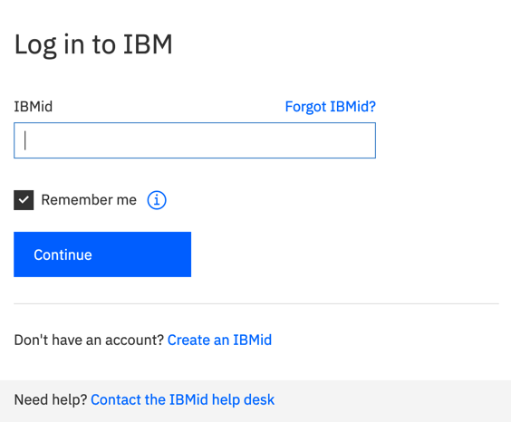{: caption="Figure 9. MAS-MS Register IBMid Login" caption-side="bottom"}
    
3. Privacy Statement may appear. If it does, click **I consent**

    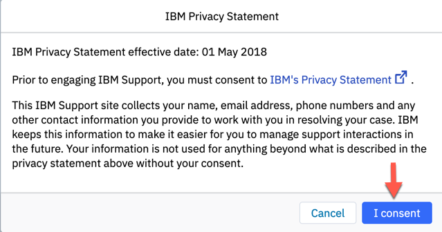{: caption="Figure 10. MAS-MS Register Privacy" caption-side="bottom"}

4. After entering your IBMid & password, the following page will be displayed.
    Click on the Request access button:

    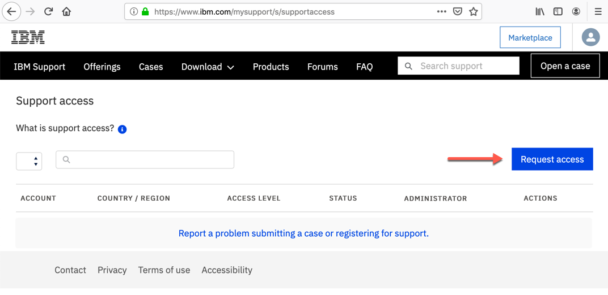{: caption="Figure 11. MAS-MS-Register-Request-Access" caption-side="bottom"}

5. The following dialog box will appear:

    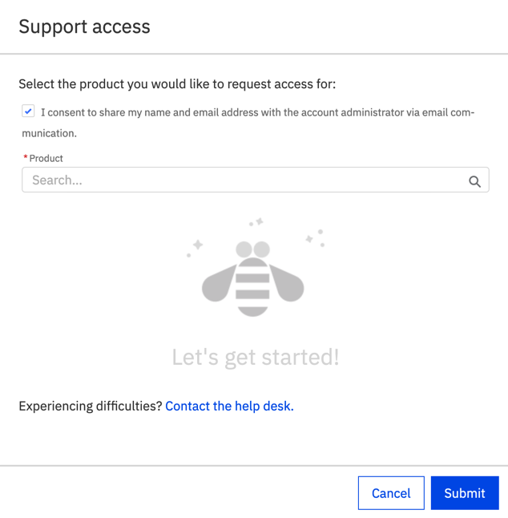{: caption="Figure 12. MAS-MS Request Access Dialog" caption-side="bottom"}

6. Be sure the I consent checkbox is checked, then type **Maximo Application Suite on Cloud** in the Product field.
    Select **Maximo Application Suite on Cloud** from the drop down list and click **Submit**

    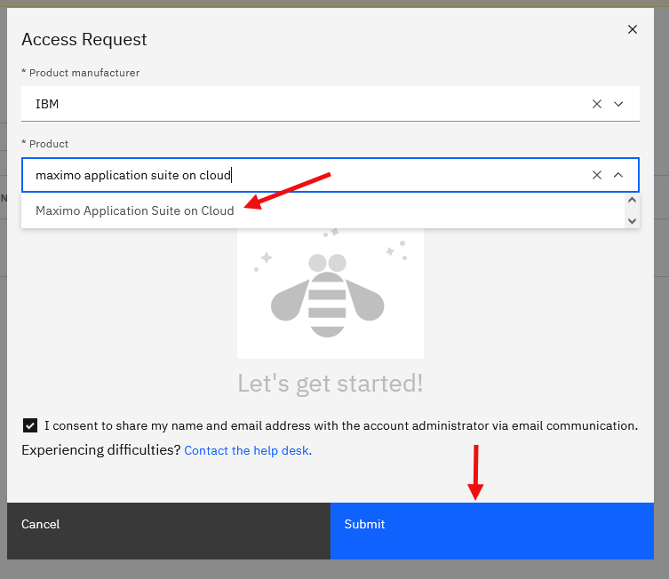{: caption="Figure 13. MAS-MS Select Product" caption-side="bottom"}
    
7. If you are not already registered for Maximo Application Suite on Cloud support, the following screen will appear.
    Complete the applicable information. Ensure Client / account name is populated and click **Submit** 

    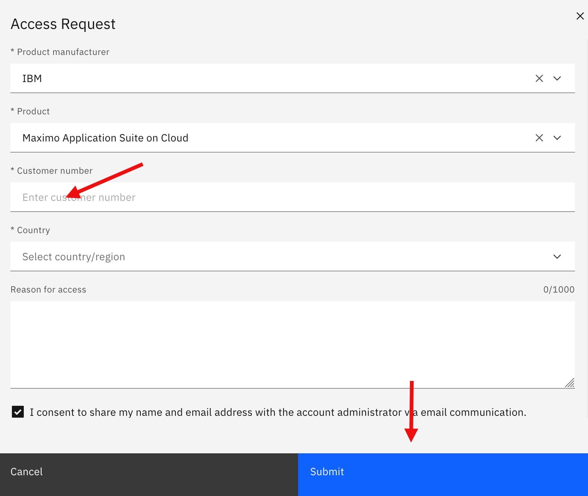{: caption="Figure 13. MAS-MS Enter Customer Number" caption-side="bottom"}
    
8. The following dialog will appear. Click **Close**

    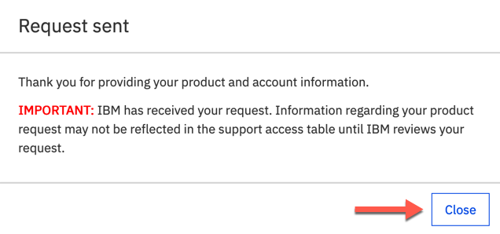{: caption="Figure 13. MAS-MS Request Sent" caption-side="bottom"}

9. An email notification will be sent confirming your request:

    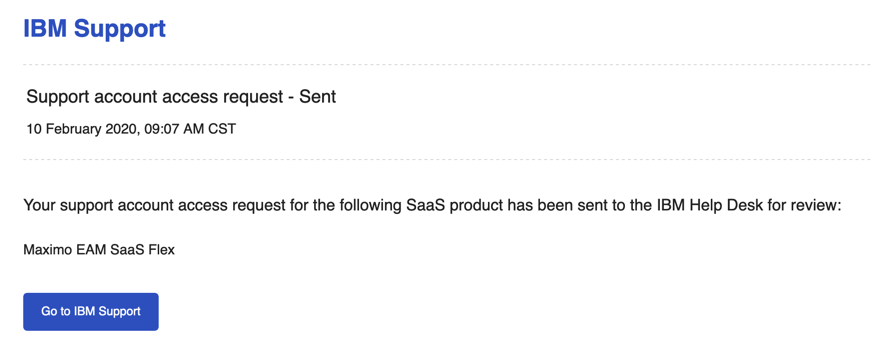{: caption="Figure 13. MAS-MS Request Sent Confirmation" caption-side="bottom"}

    Note: 
    Once you request has been submitted, please be patient. It will take some time (up to 24 hours) for IBM to review and approve your request.

    To confirm your access, login with your IBMid to the Support Access page:
   
    https://www.ibm.com/mysupport/s/supportaccess

    You should see your product access with a Status of ‘Approved’ under your ACCOUNT:

    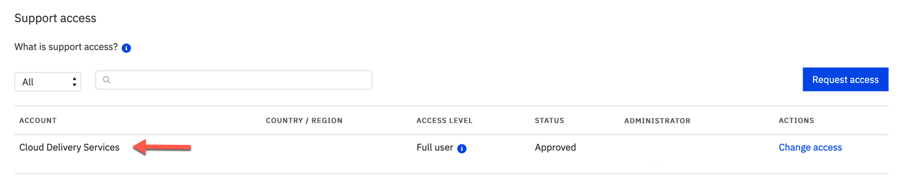{: caption="Figure 13. MAS-MS Request Approved" caption-side="bottom"}

    If you need support, see the next section [How to Create a Case](#how-to-create-a-case)

## How to Create a Case
{: #how-to-create-a-case}

This section describes how to create a case for Maximo Application Suite as a Service (MAS-SaaS)

1. Access the IBM Support Community:

    https://www.ibm.com/mysupport

2. Click the **Open a case** button on top right of page.

3. Sign in with valid IBMid:

    Please note:  If you do not have an IBMid, or your IBMid has not been registered with a valid product and customer account, go to the following link(s):

    [How to Create An IBMid](#how-to-create-an-ibmid)

    [Register for Maximo Application Suite Support](#how-to-register-for-mas-support)

4. On the following page, populate all required (*) fields ensuring **Maximo Application Suite on Cloud** is selected for Product and click on the **Submit Case** button

5. Case Creation will be confirmed and case number referenced:
    
    Note: Cases are (9) digit numbers preceded with “TS”

    You will also receive an email confirming the Case #

6. Click *Back to all cases* (in the upper left hand corner) or go to https://www.ibm.com/mysupport/s/my-cases to see a full list of your cases.

## Next steps
{: #next-steps}

1. Designate member(s) of your staff to subscribe to the [Client Communications Center (CCC)](/docs/mas-ms?topic=mas-ms-client-communications-center) in order to receive important information and notifications regarding your environment(s):

    https://status.suite.maximo.com

2. Add additional users to your account, login to Maximo Application Suite, click the administration icon in the menu bar, and select Administration > Users.

3. Refer to the Reference section for further information on MAS-SaaS operations and support, maintenance, security and the additional topics.

4. For further details on IBM Maximo Application Suite, please refer to IBM Maximo Application Suite documentation:

    https://www.ibm.com/docs/en/mas

5. To get help and support for your Maximo Application Suite as a Service, see the IBM support guide on IBM.com:

    https://www.ibm.com/support/pages/node/733923