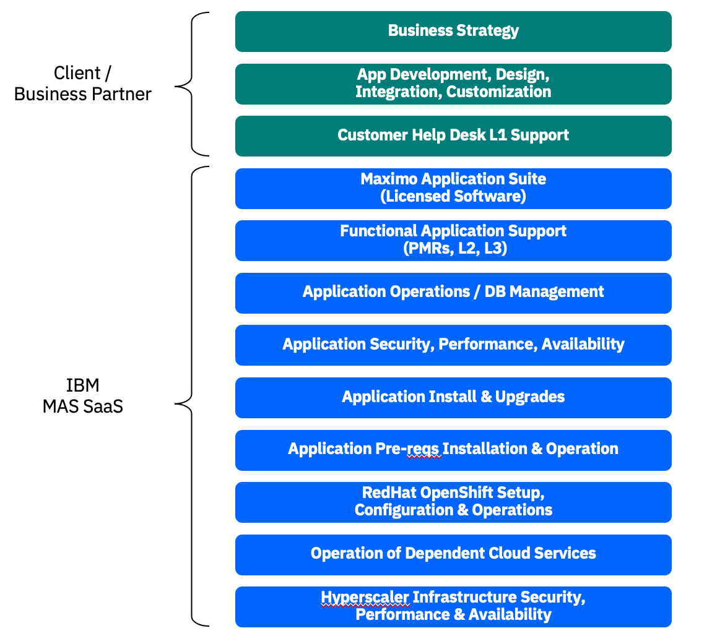

---

copyright:
  years: 2015, 2020
lastupdated: "2020-11-12"

subcollection: mas-saas

---

{:shortdesc: .shortdesc}
{:screen: .screen}  
{:codeblock: .codeblock}  
{:pre: .pre}
{:tip: .tip}
{:note: .note}
{:external: target="_blank" .external}

# Services
{: #services}

## Scope of Services
{: #scope-of-services}

IBM Maximo Application Suite as a Service (MAS-SaaS) is an offering supported by IBM's SRE team. IBM has been hosting Maximo systems for over 12 years and has deep experience provisioning and supporting Maximo in Cloud environments. The SRE team is solely focused on Maximo Application Suite delivery, providing expert IT administration for both infrastructure and operations and support for customers through the IBM Support Community Portal. Customers interact with the IBM Product Support and SRE team members via case creation, interaction and followup. Team members are based out of Canada, the United States, Brazil, Ireland, India, China and Australia. 

MAS-SaaS is a subscription based hosting service offered on the Amazon Web Services (AWS) platform.

{: caption="Figure 1. MAS-SaaS Scope of Services" caption-side="bottom"}